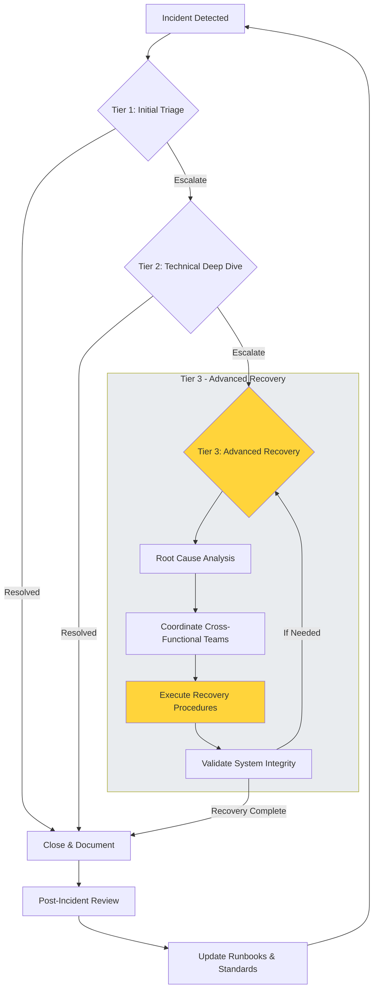

# Sample DR Test Runbook Template

## Test Details

| Field | Value |
| :--- | :--- |
| Test ID | DR-2025-001 |
| Date | [Date] |
| Scope | [Systems included] |
| Type | [Full failover / Tabletop / Restore test] |
| RTO Target | [e.g., 4 hours] |
| RPO Target | [e.g., 15 minutes] |

---

## Roles and Responsibilities

| Role | Name | Contact | Responsibility |
| :--- | :--- | :--- | :--- |
| Test Lead | [Name] | [Contact] | Overall coordination, go/no-go decisions |
| Technical Lead | [Name] | [Contact] | Technical execution, restore coordination |
| Business Owner | [Name] | [Contact] | Business validation, impact assessment |
| Communications | [Name] | [Contact] | Internal/external updates |
| Documentation | [Name] | [Contact] | Logging actions, capturing lessons |

---

## Pre-Test Checklist

- [ ] Stakeholders notified of test window
- [ ] Runbooks reviewed and current
- [ ] Backup integrity verified for all systems in scope
- [ ] Recovery environment ready (isolated if needed)
- [ ] Success criteria defined and documented
- [ ] Rollback plan confirmed

---

## Test Execution Timeline

| Time | Action | Owner | Status |
| :--- | :--- | :--- | :--- |
| T+00:00 | Test start – declare DR event | Test Lead | [ ] |
| T+00:15 | Execute restores per runbook | Technical Lead | [ ] |
| T+[time] | Business validation | Business Owner | [ ] |
| T+[time] | Rollback (if applicable) | Technical Lead | [ ] |
| T+[time] | Test end | Test Lead | [ ] |

---

## Incident Escalation Flow (Tier 3 Perspective)

---

## Post-Test Actions

### What Worked
- [Capture successful elements]

### What Needs Improvement
- [Capture gaps and issues]

### Action Items

| Action | Owner | Due Date |
| :--- | :--- | :--- |
| [Action] | [Name] | [Date] |
| [Action] | [Name] | [Date] |

---

## Sign-Off

| Role | Signature | Date |
| :--- | :--- | :--- |
| Test Lead | | |
| Technical Lead | | |
| Business Owner | | |
